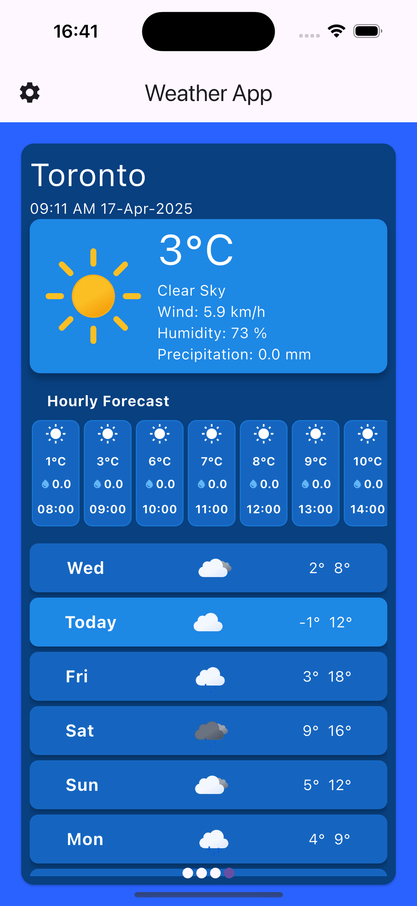
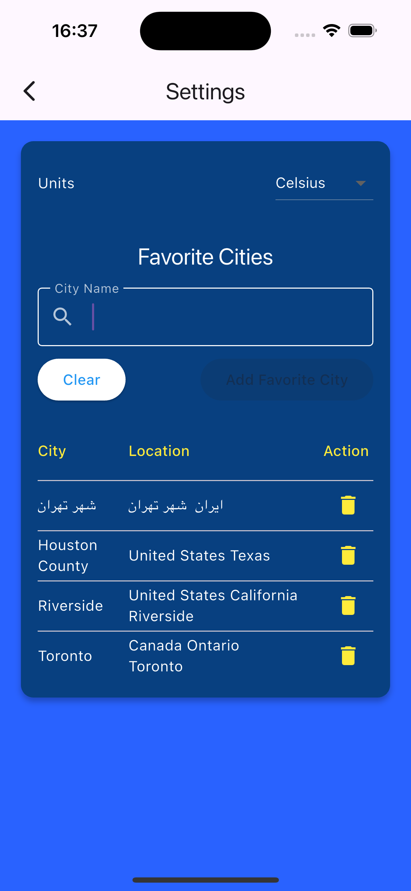
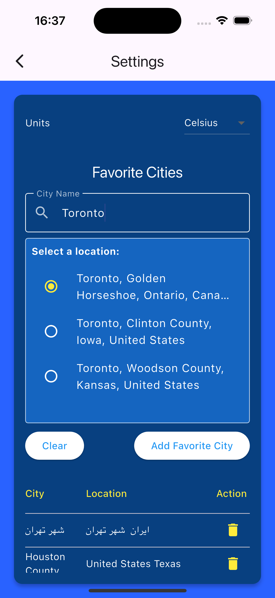

# Weather App
A modern weather application built with Flutter, showcasing real-time weather information for multiple locations. 
This project represents my initial venture into Flutter development, leveraging advanced AI tools for development optimization.

The development process incorporated:
- GitHub Copilot (O3-mini model) for initial code generation
- Augment AI for code refinement and optimization
- VSCode's Agent mode for intelligent development assistance

The application has been thoroughly tested across multiple platforms:
- iOS: iPhone 16 simulator (iOS 18.1)
- Android: API 35 Emulator and physical device
- Web platform

## Features
- Display current weather conditions
- Show hourly and daily forecasts
- Save favorite locations
- Toggle between Celsius and Fahrenheit
- Responsive design for web and mobile

## Technologies Used
- Flutter
- Provider for state management
- HTTP for API requests
- SQLite for local storage
- SVG rendering for weather icons

## Screenshots

  
  
     

